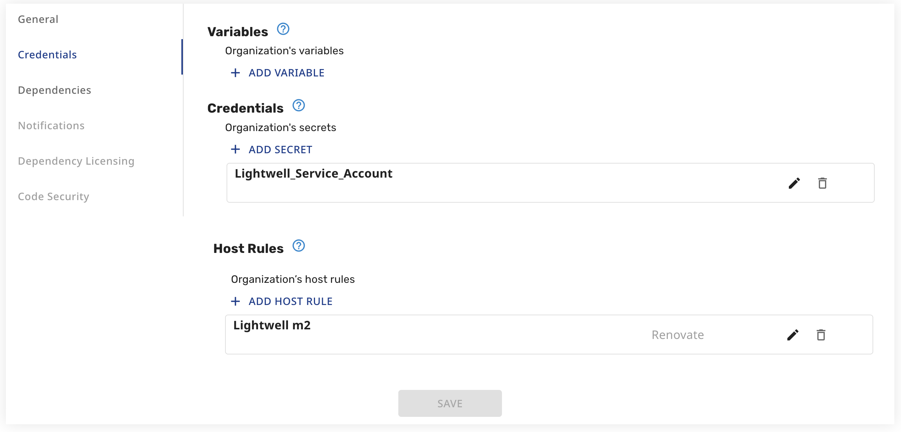
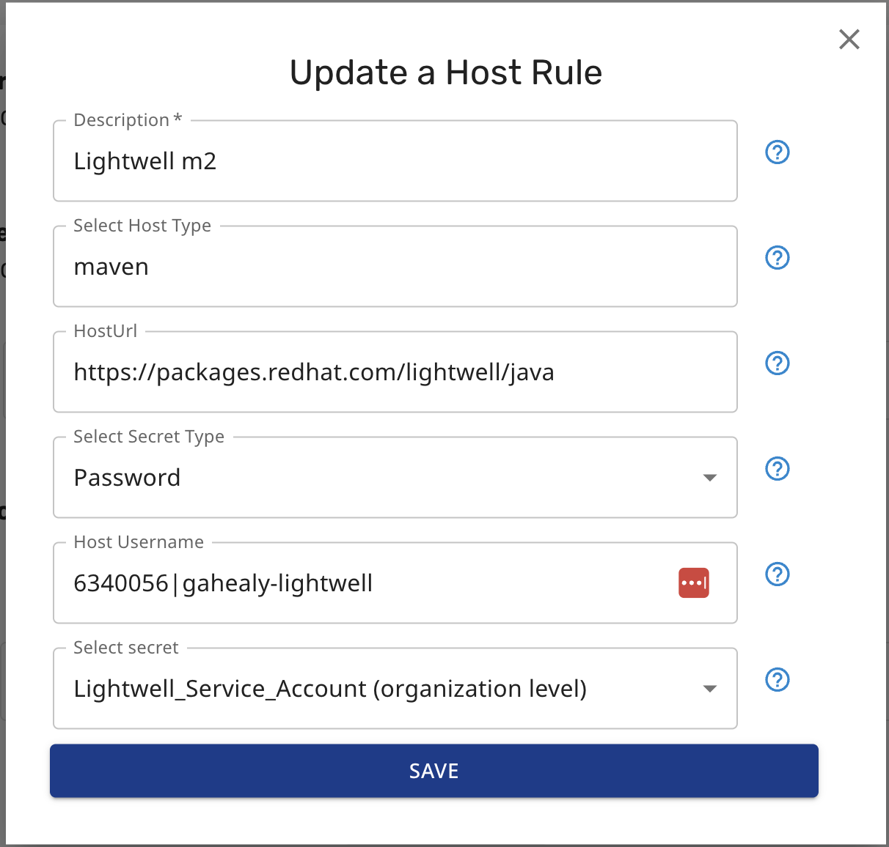

# lightwell-playground

Small Java demo for [Red Hat Lightwell](https://packages.redhat.com/) / Trusted Packages — Maven deps pulled from remediated and validated catalogs instead of (or preferred over) Central.

## Build

Needs `LIGHTWELL_USERNAME` and `LIGHTWELL_TOKEN` (locally via `scripts/_creds.sh`, or GitHub Actions secrets in CI):

```bash
source scripts/_creds.sh
mvn clean install --batch-mode --settings=.m2/settings.xml
```

## Renovate





## AI skill

[/upgrade-dependencies](.cursor/skills/upgrade-dependencies) — bumps `pom.xml` with Lightwell preference.
