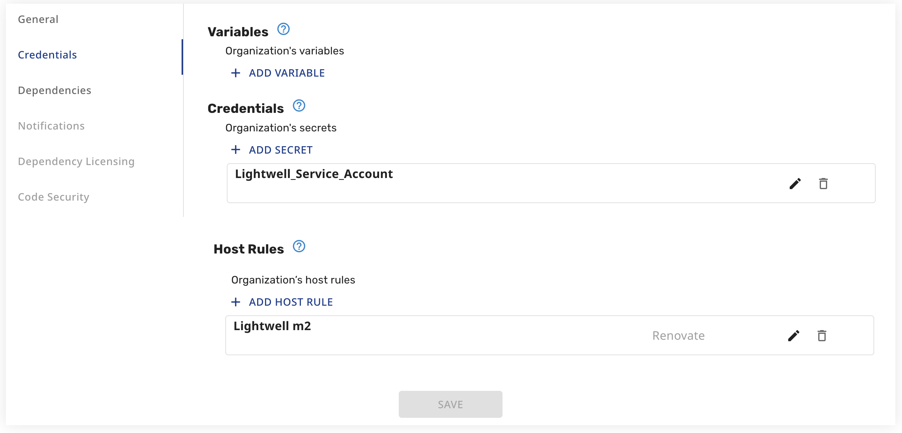
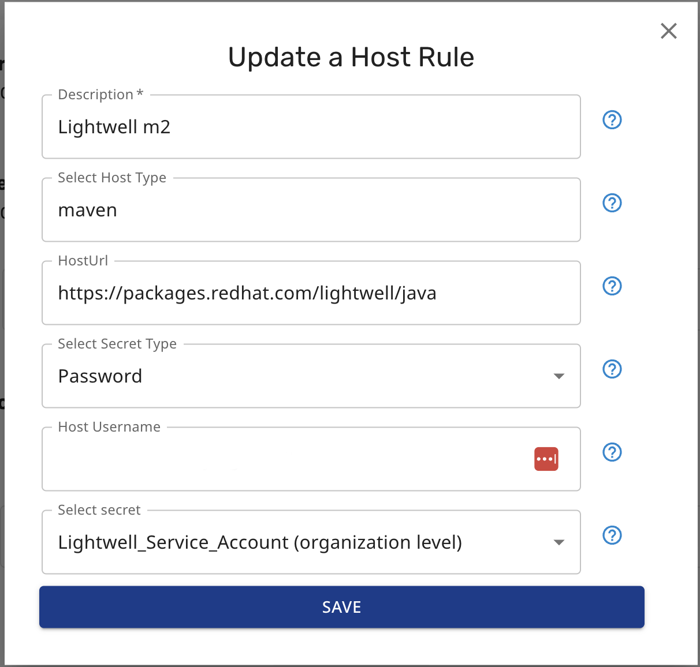

# lightwell-playground

Small Java demo for [Red Hat Lightwell](https://console.redhat.com/lightwell/demo) / Trusted Packages — Maven deps pulled from the [public Lightwell demo](https://packages.redhat.com/api/pulp-content/public-lightwell-demo/) remediated and validated catalogs instead of (or preferred over) Central.

## Build

Needs `LIGHTWELL_USERNAME` and `LIGHTWELL_TOKEN` (locally via `scripts/_creds.sh`, or GitHub Actions secrets in CI):

```bash
source scripts/_creds.sh
mvn clean install --batch-mode --settings=.m2/settings.xml
```

## Renovate


<br>


## AI skills

Shared helpers: [/lightwell-shared](.cursor/skills/lightwell-shared/packages-redhat.md).

- [/upgrade-directs](.cursor/skills/upgrade-directs) — bump direct `pom.xml` deps (plan → collect → apply → summary)
- [/upgrade-transitives](.cursor/skills/upgrade-transitives) — promote remediated transitive fixes (plan → collect → apply → summary)
- [/verify-attestations](.cursor/skills/verify-attestations) — cosign provenance check for Lightwell jars
- [/add-osv-to-renovate](.cursor/skills/add-osv-to-renovate) — comment OSV data on Renovate PRs
